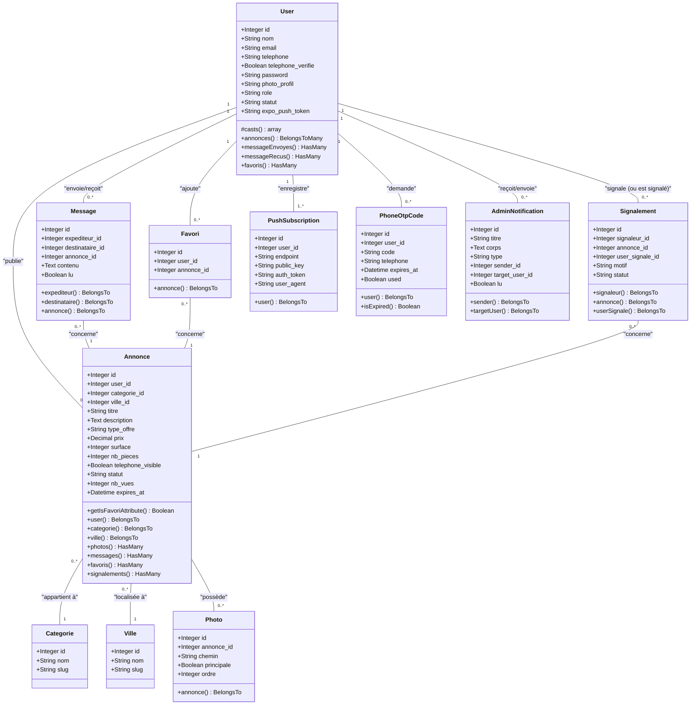
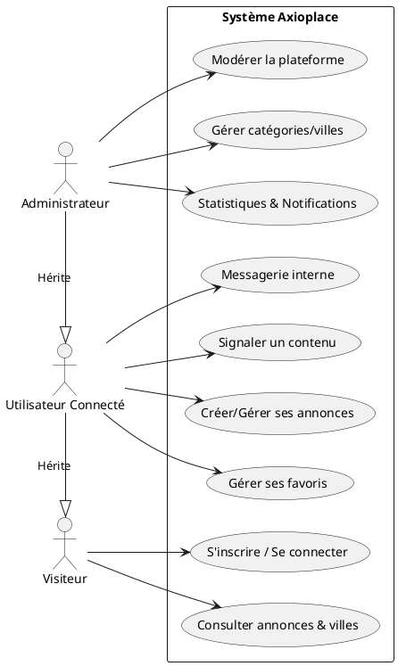
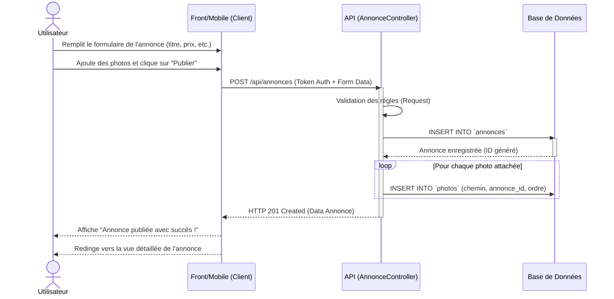
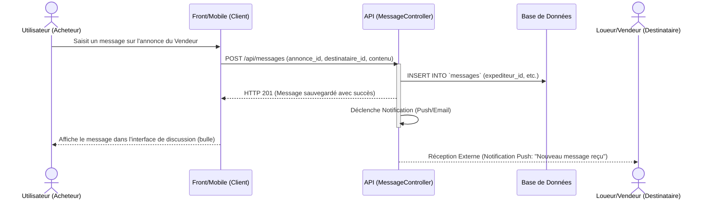
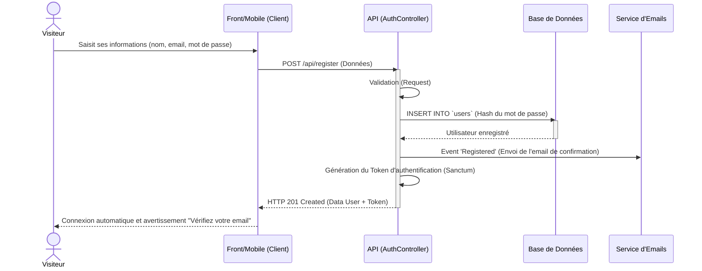
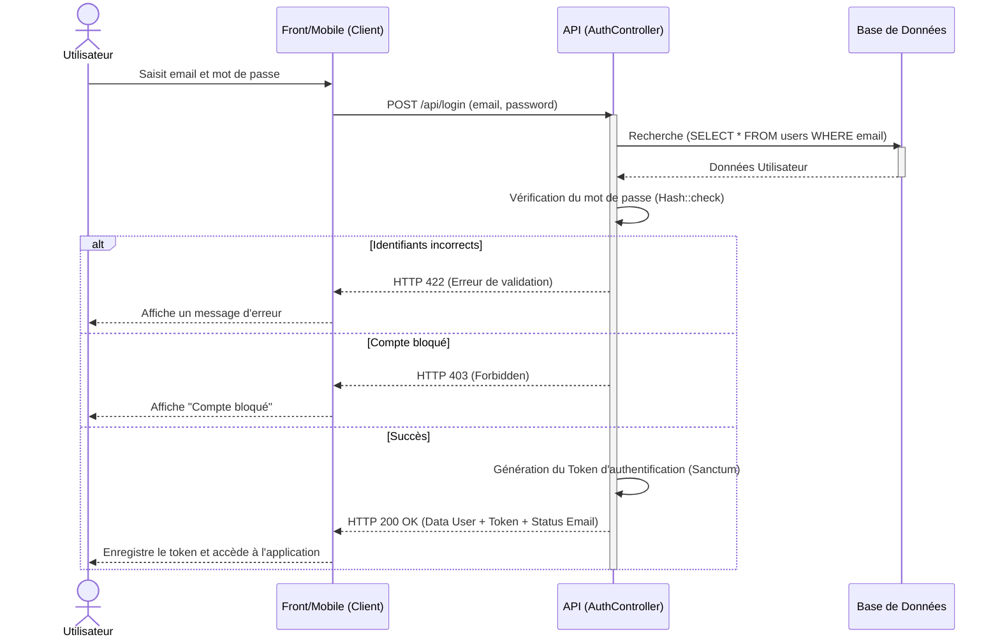

# Architecture de l'application Axioplace

Suite à l'analyse du projet, notamment de l'API Laravel (Modèles et Routes), voici la structure approfondie du système représentée sous forme de diagrammes UML générés avec Mermaid.

## 1. Diagramme de Classes (Modèle de Données)

Ce diagramme illustre les différentes entités du système (basées sur les Modèles Eloquent) et leurs relations.



## 2. Diagramme des Cas d'Utilisation

Ce diagramme présente les interactions possibles entre les différents types d'acteurs (Visiteur, Utilisateur, Administrateur) et le système Axioplace.

```text
(Note : Mermaid ne possède pas de véritable moteur pour les Cas d'Utilisation. Les rendus Mermaid ressemblent à des bulles génériques sans "bonhommes". Si vous souhaitez le vrai rendu UML avec les bonhommes et le cadre du système, utilisez le code PlantUML ci-dessous. Vous pouvez le copier sur le site planttext.com ou dans votre éditeur si PlantUML est supporté).
```



## 3. Diagrammes de Séquence

Voici deux diagrammes de séquence illustrant les parcours fonctionnels les plus importants.

### A. Création d'une nouvelle Annonce



### B. Envoi d'un message sur une Annonce (Mise en relation)



### C. Inscription (Création de compte)



### D. Connexion (Login)


